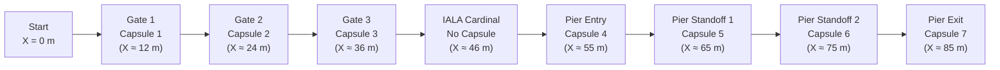

# Ocean Regatta 2026 — Official Rules & Scoring 🏁

Official technical specifications, course definition, and scoring criteria for the **Ocean Regatta 2026 Edition (Channel & Pier Challenge)**.

---

## 1. Competition Overview

The 2026 challenge evaluates an autonomous surface vehicle (USV, Blue Robotics BlueBoat) navigating an open coastal course under environmental disturbances.



### System Constraints & Limits

| Parameter | Specification | Strict Rule |
| :--- | :--- | :--- |
| **Vehicle** | Blue Robotics BlueBoat | Differential twin-thruster USV |
| **Actuator Limits** | $T_{\text{left}}, T_{\text{right}} \in [-50.0\text{ N}, +50.0\text{ N}]$ | Clamped by driver hardware abstraction layer |
| **Max Simulation Time** | $T_{\max} = 180.0\text{ s}$ | Run terminates automatically at 180 s (`TIMEOUT`) |
| **Total Course Length** | $\approx 85\text{ m}$ | Sequential progression through all 3 phases |
| **Sensors Provided** | IMU (50 Hz), GPS (5 Hz), Ping2 Sonar (10 Hz, port-facing), Buoy Detector | Raw data via `blueboat_driver.py` API |
| **Disturbances** | Current ($0.30\text{--}0.70\text{ m/s}$), wave drift, motor asymmetry, battery wear | Randomized per seed |

---

## 2. Course Layout & Progression Rules

Progression through the course is strictly sequential. Waypoints must be cleared in the specified order.

```
                                  [ PIER WALL / QUAY ] (Y ≈ 6.0 m, angle ±5°)
-------------------------------------------------------------------------------------------------
          Entry Gate            Capsule 5              Capsule 6            Exit Gate
            (X ≈ 55 m)            (X ≈ 65 m)             (X ≈ 75 m)           (X ≈ 85 m)
               ●                      ◎                      ◎                    ●
               ◎ [Capsule 4]                                                      ◎ [Capsule 7]
               ●                                                                  ●
-------------------------------------------------------------------------------------------------

   Start       Gate 1                 Gate 2                 Gate 3               Cardinal Mark
   (X=0, Y=0)  (X ≈ 12 m)             (X ≈ 24 m)             (X ≈ 36 m)           (X ≈ 46 m)
     🚤            ●                      ●                      ●                    ▲
                   ◎ [Capsule 1]          ◎ [Capsule 2]          ◎ [Capsule 3]        ▲ (No capsule)
                   ●                      ●                      ●
```

### Phase 1: Channel Gates (Waypoints 1--3)

* **Gate Geometry**: 3 consecutive gates spaced along the channel axis ($X \approx 12\text{ m}, 24\text{ m}, 36\text{ m}$).
  * **Port Mark**: Red cylinder ($\text{radius } 0.25\text{ m}$, $\text{height } 1.0\text{ m}$).
  * **Starboard Mark**: Green cone ($\text{radius } 0.30\text{ m}$, $\text{height } 1.0\text{ m}$).
  * **Gate Width**: $5.0\text{ m}$ to $6.0\text{ m}$ between buoys.
* **Buoy Equilibrium Drift**: Buoys drift $\approx 1.0\text{ m}$ according to current direction and surface wavelets.
* **Waypoint Capsule**: A 3D interactive capsule of radius $R = 1.0\text{ m}$ is located at the center of each gate.
* **Validation Criteria**: The boat must pass within $3.5\text{ m}$ of the gate center to clear the waypoint. Precision points are scored based on the closest approach distance.

### Phase 2: IALA Cardinal Mark Rounding (Waypoint 4)

A single IALA cardinal mark is moored at $X \approx 46\text{--}48\text{ m}$, $Y \in [-1.5\text{ m}, +1.5\text{ m}]$.

* **No Capsule**: No waypoint capsule is placed on the cardinal mark.
* **Randomized Type**: The buoy type is randomly assigned per run (**NORTH**, **SOUTH**, **EAST**, or **WEST**).
* **Validation Rule**: The vehicle must pass within $10.0\text{ m}$ of the buoy while remaining on the regulatory safe quadrant:

| Cardinal Type | Topmark Cones | Safe Passing Side | Strict Referee Condition |
| :--- | :--- | :--- | :--- |
| **NORTH** | Both cones pointing **UP** (▲▲) | Round to the **North** | $y_{\text{boat}} > y_{\text{buoy}} + 1.0\text{ m}$ and $d \le 10.0\text{ m}$ |
| **SOUTH** | Both cones pointing **DOWN** (▼▼) | Round to the **South** | $y_{\text{boat}} < y_{\text{buoy}} - 1.0\text{ m}$ and $d \le 10.0\text{ m}$ |
| **EAST** | Cones base-to-base (▲ over ▼) | Round to the **East** | $x_{\text{boat}} > x_{\text{buoy}} + 1.0\text{ m}$ and $d \le 10.0\text{ m}$ |
| **WEST** | Cones point-to-point (▼ over ▲) | Round to the **West** | $x_{\text{boat}} < x_{\text{buoy}} - 1.0\text{ m}$ and $d \le 10.0\text{ m}$ |

* **Points**: Binary award ($+250\text{ pts}$ if compliant, $0\text{ pts}$ if bypassed on the wrong side).

### Phase 3: Pier Wall Corridor (Waypoints 5--7)

A solid quay wall spans $X = 35\text{ m}$ to $X = 95\text{ m}$ on the port side, oriented with an angle $\theta \in [-5.0^\circ, +5.0^\circ]$.

* **Checkpoint 4 (Pier Entry Gate, $X \approx 55\text{ m}$)**: Gate marked by two buoys with Capsule 4 at the center.
* **Checkpoint 5 (Pier Standoff 1, $X \approx 65\text{ m}$)**: Capsule 5 positioned at exactly $5.0\text{ m}$ lateral distance from the pier wall.
* **Checkpoint 6 (Pier Standoff 2, $X \approx 75\text{ m}$)**: Capsule 6 positioned at exactly $5.0\text{ m}$ lateral distance from the pier wall.
* **Checkpoint 7 (Pier Exit Gate, $X \approx 85\text{ m}$)**: Gate marked by two buoys with Capsule 7 at the center, defining the course finish line.

---

## 3. Scoring System & Formulas

The total run score is calculated by the referee system upon run completion or termination:

$$S_{\text{total}} = S_{\text{initial}} + \sum_{k=1}^{7} S_{\text{capsule}, k} + S_{\text{cardinal}} + S_{\text{time}} - S_{\text{penalty}}$$

### Initial Capital

Every evaluation run starts with an initial balance of:

$$S_{\text{initial}} = +1000\text{ pts}$$

### Capsule Precision Scoring Formula

Each of the 7 interactive capsules has a total radius $R = 1.00\text{ m}$ and an inner full-score radius $r_{\min} = 0.50\text{ m}$.

Let $d_{\min}$ denote the minimum Euclidean distance between the center of the vehicle and the center of capsule $k$ during traversal:

$$P(d_{\min}) = \begin{cases} 1.0 & \text{if } d_{\min} \le 0.50\text{ m} \\ \dfrac{1.00 - d_{\min}}{1.00 - 0.50} & \text{if } 0.50\text{ m} < d_{\min} < 1.00\text{ m} \\ 0.0 & \text{if } d_{\min} \ge 1.00\text{ m} \end{cases}$$

The points awarded for capsule $k$ are:

$$S_{\text{capsule}, k} = S_{\max, k} \times P(d_{\min})$$

### Time Bonus Formula

The time bonus is awarded **only if all 7 capsules and the cardinal mark are cleared without collision** before the 180 s timeout:

$$S_{\text{time}} = \max\left(0, \left\lfloor (180.0 - t_{\text{elapsed}}) \times 10 \right\rfloor\right)$$

* $t_{\text{elapsed}}$ is the official simulation time in seconds at the moment the exit gate is validated.
* Runs terminated by collision or timeout receive $S_{\text{time}} = 0\text{ pts}$.

### Points Summary Table

| Event | Location | Max Points | Validation Condition |
| :--- | :--- | :---: | :--- |
| **Initial Capital** | Start | $+1000$ | Awarded at run initialization |
| **Gate 1** | Capsule 1 ($X \approx 12\text{ m}$) | $+150$ | $P(d_{\min})$ precision formula |
| **Gate 2** | Capsule 2 ($X \approx 24\text{ m}$) | $+150$ | $P(d_{\min})$ precision formula |
| **Gate 3** | Capsule 3 ($X \approx 36\text{ m}$) | $+150$ | $P(d_{\min})$ precision formula |
| **Cardinal Mark** | Buoy Rounding ($X \approx 46\text{ m}$) | $+250$ | Correct regulatory quadrant ($d \le 10\text{ m}$) |
| **Pier Entry Gate** | Capsule 4 ($X \approx 55\text{ m}$) | $+150$ | $P(d_{\min})$ precision formula |
| **Pier Standoff 1** | Capsule 5 ($X \approx 65\text{ m}$) | $+100$ | $P(d_{\min})$ at $5.0\text{ m}$ wall standoff |
| **Pier Standoff 2** | Capsule 6 ($X \approx 75\text{ m}$) | $+100$ | $P(d_{\min})$ at $5.0\text{ m}$ wall standoff |
| **Pier Exit Gate** | Capsule 7 ($X \approx 85\text{ m}$) | $+150$ | $P(d_{\min})$ precision formula |
| **Time Bonus** | Exit Gate | $+10\text{ / s}$ | Awarded only on full course completion |
| **Pier Collision** | Quay Structure | $-600$ | Physical contact $\rightarrow$ immediate termination |

---

## 4. Disqualification & Termination Rules

### Collision Rule (`COLLISION`)
* Any physical contact between the vehicle hull and the pier/quay wall triggers an immediate stop.
* Penalty: $-600\text{ pts}$ deducted from the current score (clamped to a minimum of 0).
* Status is recorded as `COLLISION`. No time bonus is awarded.

### Timeout Rule (`TIMEOUT`)
* The maximum allowable simulation time is $180.0\text{ s}$.
* If the exit gate is not cleared before $t = 180.0\text{ s}$, the run terminates immediately.
* Points accumulated up to $t = 180.0\text{ s}$ are retained. No time bonus is awarded.

### Critical Pier Drift
* While operating within the pier zone ($X \in [35.0\text{ m}, 95.0\text{ m}]$), the lateral distance to the pier wall must remain between $1.0\text{ m}$ and $8.0\text{ m}$.
* A lateral distance $< 1.0\text{ m}$ or $> 8.0\text{ m}$ flags `critical_drift_exceeded = true` in the official evaluation report.

---

## 5. Official Badges Reference

Distinction badges are automatically verified and awarded by the referee engine based on telemetry data:

| Badge | Title | Category | Referee Award Criteria |
| :---: | :--- | :---: | :--- |
| 👑 | **Quay Sovereign** | Exclusive | Continuous tenure at Rank #1 exceeding 72 hours on official scoreboard. |
| ⚡ | **Speed Demon** | Exclusive | Minimum simulation time among all non-colliding course completions. |
| 🐢 | **Sea Turtle** | Exclusive | Maximum simulation time on fully cleared course without timing out. |
| 🎯 | **Sniper** | Exclusive | 100% precision score on all 7 interactive capsules ($d_{\min} \le 0.50\text{ m}$). |
| 🔋 | **Watt Miser** | Exclusive | Minimum integral of absolute thruster forces $\int (|T_L| + |T_R|) dt$ on completion. |
| 🦇 | **Sonar Whisperer** | Exclusive | Standoff error $\le 0.15\text{ m}$ from the $5.0\text{ m}$ setpoint across $X \in [55, 85\text{ m}]$. |
| 🔱 | **Poseidon's Chosen** | Exclusive | Course completed with seed current $\ge 0.65\text{ m/s}$ and battery factor $\le 0.90$. |
| 🏹 | **Minimalist** | Exclusive | Lowest total evaluation attempts among completed teams. |
| 🐙 | **Kraken's Grip** | Secret | Total yaw change $|\Delta \psi| \ge 720^\circ$ during run while clearing waypoints. |
| 🧜‍♀️ | **Siren's Call** | Standard | Passing distance to cardinal buoy $< 1.5\text{ m}$ on regulatory side without contact. |
| 🧭 | **Navigator** | Standard | Rounded IALA cardinal mark on regulatory safe quadrant within $10.0\text{ m}$. |
| 🌊 | **Drift Master** | Standard | Corridor distance kept strictly between $1.0\text{ m}$ and $8.0\text{ m}$ ($X \in [35, 95\text{ m}]$). |
| 📐 | **Edge of Glory** | Standard | Closest approach to quay wall between $1.01\text{ m}$ and $1.15\text{ m}$ without contact. |
| 🚀 | **Lead Foot** | Standard | Motor thrust clamped at $\pm 50.0\text{ N}$ for $\ge 85\%$ of total run time. |
| 🦀 | **Crab Walk** | Fun | Gate traversal with reverse surge velocity ($v_x < -0.2\text{ m/s}$). |
| 🍩 | **Donut King** | Fun | Three continuous in-place rotations ($|\Delta \psi| \ge 1080^\circ$) with displacement $< 2\text{ m}$. |
| 🎛️ | **PID Tremors** | Fun | Thruster command sign reversals exceeding 120 cycles within a 30-second window. |
| 🩹 | **Tis But a Scratch** | Resilience | Successful completion ($> 1500\text{ pts}$) immediately after a COLLISION run. |
| ☕ | **Espresso Powered** | Grind | Submission frequency $\ge 5$ runs recorded within 6 consecutive hours. |
| 🌅 | **Dawn Patrol** | Standard | Run evaluated between 05:00 and 07:30 UTC. |
| 🦉 | **Night Owl** | Standard | Run evaluated between 23:00 and 04:00 UTC. |
| 🚢 | **Titanic** | Standard | Hull contact registered with quay or pier structure. |
| ⚓ | **Davy Jones' Locker** | Consolation | Simulation aborted or failed before clearing Gate 1 ($X < 12.0\text{ m}$). |
