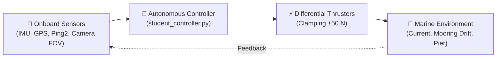

# Ocean Regatta 🚤🌊

> **International Autonomous Marine Robotics Competition (Simulation & Real-World Trials)**

Welcome to the official portal of **Ocean Regatta**. This collegiate and engineering challenge pits autonomous navigation algorithms against complex marine environments, deploying autonomous surface vehicles (USV, Blue Robotics *BlueBoat*) and autonomous underwater vehicles (AUV, *BlueROV2*) in **Gazebo Jetty** simulation and real-world sea trials.

[Register Your Team 🚤](register.md){ .md-button .md-button--primary }
[Quick Start Guide :octicons-arrow-right-24:](quickstart.md){ .md-button }

---

## 🧭 Competition Spirit & Scope

The ocean is an unforgiving environment: cross currents, surface waves, intermittent communication drops, acoustic sensor noise, and strict international maritime collision regulations (IALA buoyage system).

Ocean Regatta benchmarks your entire robotic autonomy pipeline:



* **Sensor Fusion & Filtering:** Inertial measurement units (50 Hz IMU), GNSS positioning (5 Hz NavSat), and single-beam acoustic sounders (Ping2 portside sonar).
* **Realistic Marine Perception:** Forward optical camera transmitting **strictly Range and Bearing** within a $\pm 55^\circ$ forward field of view (FOV), with zero artificial cheating IDs.
* **Robust Marine Control:** Cross-current drift compensation, wave pitch/roll damping, and millimeter-level pier wall-following.

---

## 🏆 Challenge Editions

Each year brings an all-new operational theater:

| Year | Edition | Vehicle & Operational Focus | Status | Documentation & Standings |
| :---: | :--- | :--- | :---: | :---: |
| **2026** | **Channel & Pier Challenge** | **USV (BlueBoat)**: Cross-current navigation, IALA cardinal rounding, and Ping2 sonar wall-following. | :material-check-circle:{ .green } **Active** | [2026 Rules](editions/2026.md) &middot; [Live Scoreboard](scoreboards/2026.md) |
| **2027** | **Subsea Inspection & Docking** | **AUV (BlueROV2)**: 3D subsea navigation, pipeline inspection, and autonomous docking. | :material-clock-outline: *Upcoming* | *Coming soon* |

---

## 🚀 3-Minute Quick Start

=== "0. Register Account"
    Before opening Pull Requests, ensure your team is approved in the participant registry:

    1. Visit the [Competitor Registration](register.md) portal.
    2. Submit the prefilled GitHub Issue form to request approval from @Teusner.
    3. Once merged into `participants.json`, automated PR grading is enabled!

=== "1. Create Repository"
    Create your own team repository from the official template:

    1. Go to [:octicons-repo-template-24: ocean-regatta-2026-template](https://github.com/ocean-regatta/ocean-regatta-2026-template).
    2. Click **"Use this template"** $\rightarrow$ **"Create a new repository"**.
    3. Clone your newly created repository:
       ```bash
       git clone https://github.com/your-org/ocean-regatta-2026-team.git
       cd ocean-regatta-2026-team
       ```

=== "2. Run Locally (Docker)"
    Run the simulation and the sample controller immediately with Docker (no robotics packages required on host):

    ```bash
    # Launch Gazebo Jetty and student controller
    ./starter_kit/run_docker.sh
    ```

    For native Ubuntu setups with Gazebo Jetty installed:
    ```bash
    ./starter_kit/run_local.sh
    ```

=== "3. Submit & Get Ranked"
    To register an official evaluated run:

    1. Implement your navigation logic in `starter_kit/student_controller.py`.
    2. Push your branch and open a **Pull Request** targeting `master`.
    3. The automated referee runs headless, posts a detailed evaluation report on your PR, and updates the **Live Scoreboard**!

---

## 🎥 3D Playback & Analysis (`gz sim --playback`)

The automated referee records the full physics state of every single run into a `.tlog` journal.

```bash
# Download the gz-replay-pr-*.zip artifact from your PR, then:
gz sim --playback ./local_output/replay
```

Inspect your trajectory in full 3D, observe buoys swaying with wavelets, watch dynamic capsules change color upon clearance, and analyze your control margins with centimeter precision!

---

!!! info "Need Help or Have Questions?"
    Check out the [Quick Start Guide](quickstart.md) or open an issue on the team template repository!
