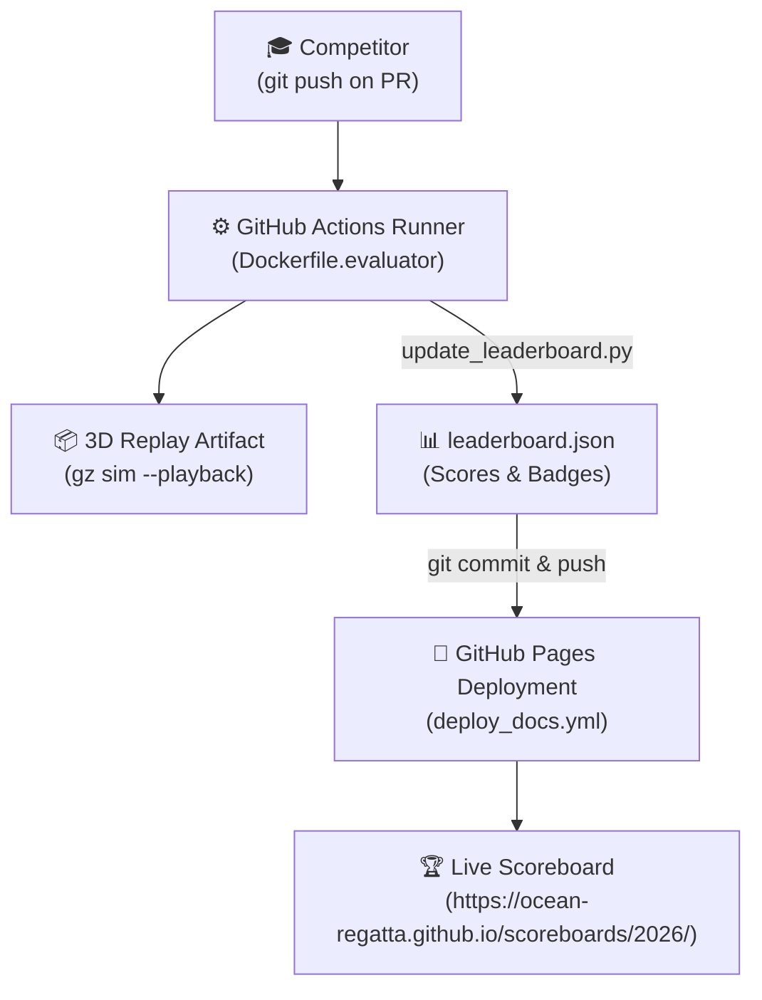

# Maintenance & Organizer Deployment Guide 🛠️

This guide outlines the technical infrastructure of **Ocean Regatta** for organizers and teaching staff: hosting MkDocs on GitHub Pages, automated static scoreboard updates, and managing evaluation secrets.

---

## 🏛️ Infrastructure Architecture

Ocean Regatta operates with **zero server infrastructure**: both the public documentation and the live interactive scoreboard are hosted **100% statically on GitHub Pages**.



---

## 🌐 1. Automated MkDocs Deployment on GitHub Pages

The documentation site uses **MkDocs Material** and deploys automatically via GitHub Actions.

### Workflow Configuration (`.github/workflows/deploy_docs.yml`)
On every push to the `master` or `main` branch:
1. Configures Python 3.11 environment.
2. Installs `mkdocs-material` and dependencies.
3. Builds the static site with `mkdocs build --clean`.
4. Deploys the static assets to GitHub Pages using official `actions/deploy-pages`.

### Enabling GitHub Pages in GitHub Settings:
1. Go to repository `ocean-regatta.github.io` (or your docs repo) $
ightarrow$ **Settings** $
ightarrow$ **Pages**.
2. Under **Build and deployment**, select **Source: GitHub Actions**.
3. Save. The site is now live at `https://<org>.github.io/`.

---

## 📊 2. Static Scoreboard Engine (`update_leaderboard.py`)

Every time a student's PR is evaluated by GitHub Actions, the runner executes the evaluation under **Gazebo Jetty** and produces `output/result.json`.

The runner then automatically updates the static scoreboard using `scripts/update_leaderboard.py`:

```bash
python scripts/update_leaderboard.py   --result output/result.json   --leaderboard docs/data/leaderboard.json   --team octocat
```

### What this script automates:
* **Ranking & Tiebreaking**: Sorts teams by descending score, then ascending elapsed time.
* **Cumulative Badges**: Detects collisions (`Titanic`), night evaluations (`Night Owl`), standoff tracking (`Drift Master`), gate progress (`Early Bird`, `Navigator`).
* **Dynamic Exclusive Titles**: Re-evaluates across the entire competition field:
  * ⚡ **Speed Demon**: Reassigned to the new fastest completed run.
  * 🐢 **Sea Turtle**: Reassigned to the slowest completed run.
  * 🎯 **Sniper**: Reassigned to the top-scoring precision run.
  * 🏹 **Minimalist**: Reassigned to the team with the fewest attempts.
* **Auto-Commit**: The updated `docs/data/leaderboard.json` is committed to the repository, which immediately triggers the GitHub Pages deployment.

### Archiving a Past Edition:
When a new competition edition begins (e.g. 2027):
1. Copy the final `docs/data/leaderboard.json` to `docs/data/leaderboard_2026.json`.
2. Move `scoreboards/2026.md` to archived status in `mkdocs.yml`:
   ```yaml
   - Scoreboards:
       - 2027 Edition (Active): scoreboards/2027.md
       - 2026 Edition (Archived): scoreboards/2026.md
   ```
3. Initialize `docs/data/leaderboard.json` with empty teams for 2027.

---

## 🔐 3. Secrets & Repository Permissions

To allow the evaluation runner to post PR comments and update `leaderboard.json`:

1. In repository **Settings** $\rightarrow$ **Actions** $\rightarrow$ **General**:
   - Under **Workflow permissions**, select **Read and write permissions**.
   - Check **Allow GitHub Actions to create and approve pull requests**.
2. If your documentation is hosted in a separate repository (e.g. `ocean-regatta.github.io`), create a Personal Access Token (PAT) with `repo` scope named `LEADERBOARD_PUSH_TOKEN` in repository secrets.

---

## 💻 4. Local Testing & Verification

### Test Scoreboard Update Script:
```powershell
python scripts/update_leaderboard.py `
  --result output/result.json `
  --leaderboard docs/data/leaderboard.json `
  --team "Team-Test"
```

### Preview Documentation & Scoreboard Locally:
```powershell
python -m mkdocs serve
```
Open [http://127.0.0.1:8000/scoreboards/2026/](http://127.0.0.1:8000/scoreboards/2026/) to verify the interactive table, badge cards, and search filtering.
