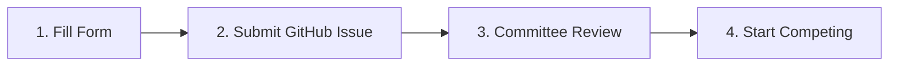

# Competitor Registration

Welcome to the **Ocean Regatta Competitor Registration Portal** 🚤

---

## 📋 Registration Procedure & Policies

To ensure fair competition, conserve dedicated simulation server resources, and prevent spam, Ocean Regatta operates a participant verification registry on the competition template repository ([Ocean-Regatta/ocean-regatta-2026-template](https://github.com/Ocean-Regatta/ocean-regatta-2026-template)).

!!! important "Registration Required for Automated PR Grading"
    Automated evaluation runs **only** for competitors registered in `participants.json` approved by the organizer (**@Teusner**). Pull Requests opened by unverified accounts will not trigger simulation server jobs or post scores to the leaderboard.

### ⏱️ Key Guidelines

* **24-Hour Review SLA:** Approvals are handled personally by the regatta committee (**@Teusner**) within **24 hours**. Once your registration issue is reviewed and your username is merged into `participants.json`, your automated PR grading pipeline activates immediately.
* **60-Minute Cooldown Policy:** Submissions adhere to a strict **60-minute cooldown** between runs to prevent seed overfitting against randomized ocean currents, wave disturbances, and thruster degradation. Teams are encouraged to test and tune their controllers locally via Docker before submitting official runs.
* **Open & Free:** Any student, academic researcher, or robotics enthusiast is welcome to participate!

---

## 🧭 Step-by-Step Registration Flow

Follow these four steps to register and begin competing:

  

    
1

    

      <strong>1. Fill Form</strong>
      Enter your GitHub handle and team information below.
    

  

  

    
2

    

      <strong>2. Submit GitHub Issue</strong>
      Review prefilled registration form and submit on GitHub.
    

  

  

    
3

    

      <strong>3. Committee Review</strong>
      Reviewed & merged into participants.json by @Teusner (≤ 24h).
    

  

  

    
4

    

      <strong>4. Start Competing</strong>
      Open Pull Requests to trigger Gazebo evaluation & rankings!
    

  

---

## ✍️ Registration Form

<noscript>
  

    
JavaScript Disabled

    
JavaScript is disabled in your browser. You can still register directly by manually opening the <a href="https://github.com/Ocean-Regatta/ocean-regatta-2026-template/issues/new?template=registration_request.yml" target="_blank" rel="noopener noreferrer"><strong>GitHub Issue Registration Template ↗</strong></a> and filling out your team details.

  

</noscript>

  <h3>
    🚤
    Competitor Registration Request
  </h3>
  
Complete the fields below to generate and submit your official registration request on GitHub.

  <form id="reg-form" novalidate onsubmit="return handleRegistrationSubmit(event)">
    <!-- GitHub Username -->
    

      <label class="reg-label" for="reg-github-username">
        GitHub Username *
      </label>
      <input
        type="text"
        id="reg-github-username"
        name="github_username"
        class="reg-input"
        placeholder="e.g. octocat (or @octocat)"
        autocomplete="username"
        spellcheck="false"
        required
      />
      
Your GitHub handle used to author commits and Pull Requests.

      
Please enter a valid GitHub username (alphanumeric and single hyphens, 1–39 characters).

    

    <!-- Team / Competitor Display Name -->
    

      <label class="reg-label" for="reg-team-name">
        Team / Competitor Display Name *
      </label>
      <input
        type="text"
        id="reg-team-name"
        name="team_name"
        class="reg-input"
        placeholder="e.g. Team Nautilus"
        required
      />
      
How your team will appear on the Live Scoreboard.

      
Please enter your team or competitor display name.

    

    <!-- Affiliation / Institution -->
    

      <label class="reg-label" for="reg-affiliation">
        Affiliation / Institution (optional)
      </label>
      <input
        type="text"
        id="reg-affiliation"
        name="affiliation"
        class="reg-input"
        placeholder="e.g. Stanford University / Acme Robotics / Independent"
      />
      
University, company, research lab, or independent competitor.

    

    <!-- Brief Strategy / Background -->
    

      <label class="reg-label" for="reg-strategy">
        Brief Strategy / Background (optional)
      </label>
      <textarea
        id="reg-strategy"
        name="strategy"
        class="reg-textarea"
        placeholder="e.g. Implementing adaptive MPC with Ping2 sonar wall following and Kalman filter sensor fusion."
        rows="3"
      ></textarea>
      
Optional notes about your planned control architecture or robotics background.

    

    <!-- Agreement Checkbox -->
    

      <label class="reg-checkbox-label" for="reg-agreement">
        <input
          type="checkbox"
          id="reg-agreement"
          name="agreement"
          required
        />
        I agree to the Ocean Regatta rules and cooldown policy
      </label>
      
You must agree to the Ocean Regatta rules and cooldown policy to register.

    

    <!-- Submit Button -->
    <button type="submit" id="reg-submit-btn" class="reg-btn-submit">
      <svg viewBox="0 0 16 16" aria-hidden="true">
        <path d="M8 0C3.58 0 0 3.58 0 8c0 3.54 2.29 6.53 5.47 7.59.4.07.55-.17.55-.38 0-.19-.01-.82-.01-1.49-2.01.37-2.53-.49-2.69-.94-.09-.23-.48-.94-.82-1.13-.28-.15-.68-.52-.01-.53.63-.01 1.08.58 1.23.82.72 1.21 1.87.87 2.33.66.07-.52.28-.87.51-1.07-1.78-.2-3.64-.89-3.64-3.95 0-.87.31-1.59.82-2.15-.08-.2-.36-1.02.08-2.12 0 0 .67-.21 2.2.82.64-.18 1.32-.27 2-.27.68 0 1.36.09 2 .27 1.53-1.04 2.2-.82 2.2-.82.44 1.1.16 1.92.08 2.12.51.56.82 1.27.82 2.15 0 3.07-1.87 3.75-3.65 3.95.29.25.54.73.54 1.48 0 1.07-.01 1.93-.01 2.2 0 .21.15.46.55.38A8.013 8.013 0 0016 8c0-4.42-3.58-8-8-8z"></path>
      </svg>
      Submit Registration via GitHub
    </button>

    <!-- Success Feedback Box -->
    

      <strong>🚀 Opening GitHub Issue in a new tab...</strong>
      

        If your browser blocked the popup window, <a id="reg-fallback-anchor" href="#" target="_blank" rel="noopener noreferrer">click here to open your prefilled GitHub Issue Form</a>.
      

    

  </form>

  <!-- Fallback footer link -->
  

    Prefer manual submission without auto-fill?
    <a href="https://github.com/Ocean-Regatta/ocean-regatta-2026-template/issues/new?template=registration_request.yml" target="_blank" rel="noopener noreferrer">
      Open the blank GitHub Issue Template &rarr;
    </a>
  

